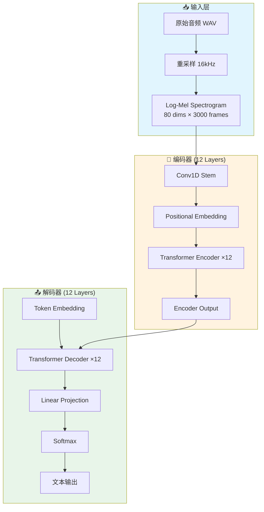

# Example: Single File Output

以下是一个小型项目分析的单文件输出示例（以 Whisper 为例）。

---

# Whisper 技术白皮书

> OpenAI Whisper: Robust Speech Recognition via Large-Scale Weak Supervision
>
> 生成时间：2024-01-15
> 分析者：Claude

---

## 1. 论文精要与宏观架构

### 1.1 核心思想

Whisper 旨在解决语音识别领域的 **数据标注瓶颈** 和 **领域泛化差** 两大痛点。传统 ASR 系统依赖高质量标注数据，成本高昂且难以覆盖多样场景。Whisper 通过 **大规模弱监督学习**（68 万小时多语言数据），实现了跨语言、跨领域的零样本泛化能力，在 50+ 语言上取得了接近人类水平的转录精度。

### 1.2 数学原理

#### 核心目标函数

$$
\mathcal{L} = -\sum_{t=1}^{T} \log P(y_t | y_{<t}, x; \theta)
$$

**变量解释**：
- $x$：输入音频特征（Log-Mel Spectrogram）
- $y = (y_1, ..., y_T)$：目标 token 序列
- $\theta$：模型参数
- $T$：序列长度

#### 多任务训练目标

Whisper 采用统一的 token 预测框架，支持多任务：

$$
\mathcal{L}_{total} = \mathcal{L}_{transcribe} + \mathcal{L}_{translate} + \mathcal{L}_{detect} + \mathcal{L}_{timestamp}
$$

### 1.3 架构逻辑图



---

## 2. 核心源码深度剖析

### 2.1 Log-Mel 特征提取

**文件位置**：`whisper/audio.py`

```python
def log_mel_spectrogram(
    audio: Union[str, np.ndarray],
    n_mels: int = 80,
    n_fft: int = 400,
    hop_length: int = 160,
):
    """
    提取 Log-Mel 频谱特征

    Args:
        audio: 音频路径或波形数据
        n_mels: Mel 滤波器组数量（默认 80）
        n_fft: FFT 窗口大小（400 = 25ms @ 16kHz）
        hop_length: 帧移（160 = 10ms @ 16kHz）

    Returns:
        mel_spec: [n_mels, T] 的 Log-Mel 特征
    """
    # Step 1: 加载音频，重采样到 16kHz
    # Why: 统一采样率，降低计算量
    if isinstance(audio, str):
        audio, sr = librosa.load(audio, sr=16000)

    # Step 2: 短时傅里叶变换 (STFT)
    # Why: 将时域信号转换为时频表示
    stft = librosa.stft(audio, n_fft=n_fft, hop_length=hop_length)
    magnitudes = np.abs(stft) ** 2  # 功率谱

    # Step 3: Mel 滤波器组
    # Why: 模拟人耳对频率的非线性感知
    mel_filter = librosa.filters.mel(sr=16000, n_fft=n_fft, n_mels=n_mels)
    mel_spec = mel_filter @ magnitudes

    # Step 4: Log 变换
    # Why: 压缩动态范围，稳定训练
    log_mel = np.log10(np.clip(mel_spec, a_min=1e-10, a_max=None))

    return log_mel
```

**关键设计解析**：

1. **25ms 窗口 / 10ms 帧移**：符合语音信号的短时平稳特性
2. **80 维 Mel 特征**：平衡表达能力和计算效率
3. **Log 变换**：模拟人耳对响度的对数感知

### 2.2 多语言 Tokenizer

**文件位置**：`whisper/tokenizer.py`

```python
class Tokenizer:
    """多语言分词器，支持转录、翻译、语言检测等任务"""

    def __init__(self, tokenizer_path: str):
        # 加载 GPT-2 风格的 BPE tokenizer
        self.tokenizer = tiktoken.get_encoding(tokenizer_path)

        # 特殊 token 定义
        self.special_tokens = {
            "<|startoftranscript|>": 50258,
            "<|en|>": 50259,      # 语言标识
            "<|transcribe|>": 50359,  # 转录任务
            "<|translate|>": 50358,  # 翻译任务
            "<|notimestamps|>": 50363,
        }

    def encode(self, text: str, lang: str, task: str) -> List[int]:
        """
        编码输入文本，添加任务前缀

        Example:
            encode("Hello", "en", "transcribe")
            → [<|startoftranscript|>, <|en|>, <|transcribe|>, ...]
        """
        tokens = [self.special_tokens["<|startoftranscript|>"]]
        tokens.append(self.special_tokens[f"<|{lang}|>"])
        tokens.append(self.special_tokens[f"<|{task}|>"])
        tokens.extend(self.tokenizer.encode(text))
        return tokens
```

---

## 3. 工程实践：部署与训练

### 3.1 环境与依赖

| 项目 | 要求 |
|-----|------|
| Python | 3.8+ |
| PyTorch | 2.0+ |
| GPU | 4GB+ (推理), 24GB+ (微调) |

```bash
# 安装
pip install openai-whisper

# 或使用 uv
uv pip install openai-whisper
```

### 3.2 快速推理

```python
import whisper

# 加载模型（可选：tiny/base/small/medium/large）
model = whisper.load_model("base")

# 推理
result = model.transcribe("audio.mp3")
print(result["text"])

# 指定语言和任务
result = model.transcribe(
    "audio.mp3",
    language="zh",
    task="transcribe"  # 或 "translate" (翻译为英文)
)
```

### 3.3 训练与微调

**关键超参数**：

| 参数 | 默认值 | 说明 |
|-----|-------|------|
| `learning_rate` | 1e-5 | 微调学习率 |
| `batch_size` | 16 | 批大小 |
| `warmup_steps` | 500 | 预热步数 |

```bash
# 微调命令
whisper-finetune \
    --model base \
    --train-data ./data/train.json \
    --output-dir ./output \
    --learning-rate 1e-5 \
    --epochs 10
```

---

## 4. 技术复盘与演进

### 4.1 优势亮点

| 维度 | 亮点 | 说明 |
|-----|------|------|
| 数据 | 68 万小时多语言 | 业界最大开源语音数据集 |
| 泛化 | 零样本跨领域 | 无需微调即可适应新场景 |
| 多任务 | 统一框架 | 转录、翻译、检测一体化 |

### 4.2 瓶颈与不足

| 瓶颈 | 影响 | 严重程度 |
|-----|------|---------|
| 长音频处理 | >30min 显存不足 | ⭐⭐⭐ |
| 实时流式 | 不支持流式推理 | ⭐⭐ |
| 特定领域 | 医疗/法律术语错误率高 | ⭐⭐ |

### 4.3 改进方向

1. **流式推理**：实现 chunk-based processing，支持实时场景
2. **长音频优化**：结合 VAD 分段 + 上下文传递

---

## 5. 资深面试官 Q&A

### Q1: Whisper 为什么使用 Transformer 而不是 Conformer？

**问题**：Conformer 结合了 CNN 和 Transformer 的优势，为什么 Whisper 仍使用纯 Transformer？

**参考答案**：

1. **工程简洁性**：纯 Transformer 架构更易实现和优化
2. **大规模数据**：68 万小时数据足以让 Transformer 学习局部模式
3. **推理效率**：避免 Conformer 中卷积的额外计算
4. **历史原因**：2022 年 Conformer 尚未成为主流

**关键要点**：
- 架构选择需权衡性能、实现复杂度、生态支持
- 大规模数据可以弥补架构的理论劣势

---

### Q2: Whisper 如何处理多语言的统一表示？

**问题**：不同语言的词汇表差异很大，Whisper 如何在一个模型中处理 99 种语言？

**参考答案**：

1. **共享词汇表**：使用 50K+ 的多语言 BPE 词表
2. **语言 token 前缀**：通过 `<|zh|>`, `<|en|>` 等前缀指定语言
3. **跨语言迁移**：高资源语言的知识可迁移到低资源语言

$$
P(y | x, L) = \text{Decoder}( \text{Encoder}(x), \text{Embed}(L) )
$$

其中 $L$ 是语言标识 token。

---

### Q3: Whisper 的 timestamp 预测是如何实现的？

**问题**：Whisper 可以输出每个词的时间戳，这是如何做到的？

**参考答案**：

将 timestamp 作为特殊 token 预测：

```python
# timestamp token 范围：50364 - 51865 (每 20ms 一个)
timestamp_tokens = [50364 + t * 20 // 1000 for t in range(3000)]
```

模型同时预测文本 token 和 timestamp token，通过 `|` 分隔：

```
<|0.00|> Hello<|0.50|> world<|1.00|>
```

---

### Q4: 如何优化 Whisper 的推理速度？

**问题**：Whisper large 模型推理较慢，如何优化？

**参考答案**：

1. **量化**：INT8 量化，速度提升 2x，精度损失 < 1%
2. **蒸馏**：用 large 蒸馏 small，精度接近
3. **批处理**：同时处理多个音频
4. **GPU 优化**：使用 Flash Attention、CUDA Graph

---

### Q5: Whisper 的训练数据是如何清洗的？

**问题**：68 万小时"弱监督"数据，如何保证质量？

**参考答案**：

1. **自动化过滤**：基于语言检测置信度过滤
2. **去重**：移除重复音频
3. **长度过滤**：移除过长/过短片段
4. **伪标签**：使用已有 ASR 系统生成初始标签，再人工抽样验证

**关键洞察**：弱监督的核心是"足够多的数据可以淹没噪声"。

---

*文档结束*
